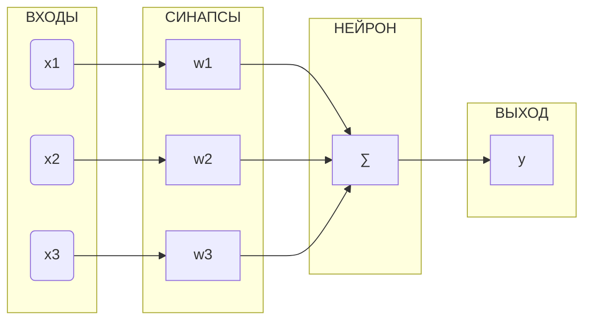

# 0. Нейронная сеть - краткая история триумфа

По настоящему эпохальное событие произошло в марте 2016 года, когда чемпион мира по игре в Go проиграл нейронной сети `AlphaGo` со счётом 4:1. Почему это так знаменательно ?

Дело в том, что в этой игре невозможно просчитать лучшие ходы, как это делали алгоритмы игры в шахматы. И здесь запредельное число вариантов, считалось, что только благодаря интуиции профессионалы могут делать лучшие ходы и одерживать победу.

И теперь мы видим, что какое-то бездуховное железо (бездушный CPU) тоже на это способно, одерживая победу в подобных состязаниях.

Анализ ходов нейросети `AlphaGo` показал, что её действия ничуть не уступают интуитивным ходам лучшего игрока.

Кажется, началась новая эпоха. Последний рубеж превосходства человека над машиной пал. Путь к этой вершине был тернист и полной сомнений.

Исторически первой считается модель нейросети, предложенная Уорреном Мак-Каллоком и Уолтером Питтсом, в далёком 1943 году.

На этот момент уже было известно, что к каждому нейрону подходит 1000 отростков (дендриты), и сигналы с них способны возбуждать нейрон. Когда это происходит нейрон формирует ответ и посылает его дальше по аксонам. Аксон - выход нейрона.

По этому принципу в модели Мак-Каллока и Питтса происходит объединение нейронов между собой в единую искусственную нейронную сеть.

Несколько позже в 1957 году Френк Розенблатт улучшил и обобщил эту идею. И миру представлена современная модель нейронной сети в виде взвешенной суммы входов с последующим нелинейным преобразованием. Здесь подобно биологическому нейрону по связям передаётся цифровой сигнал, умноженный на вес связи. Если на входе сумма этих произведений превышает определённый порог, то
нейрон формирует положительный выходной сигнал,

Объединение таких нейронов в единую сеть получило название персептрон.

